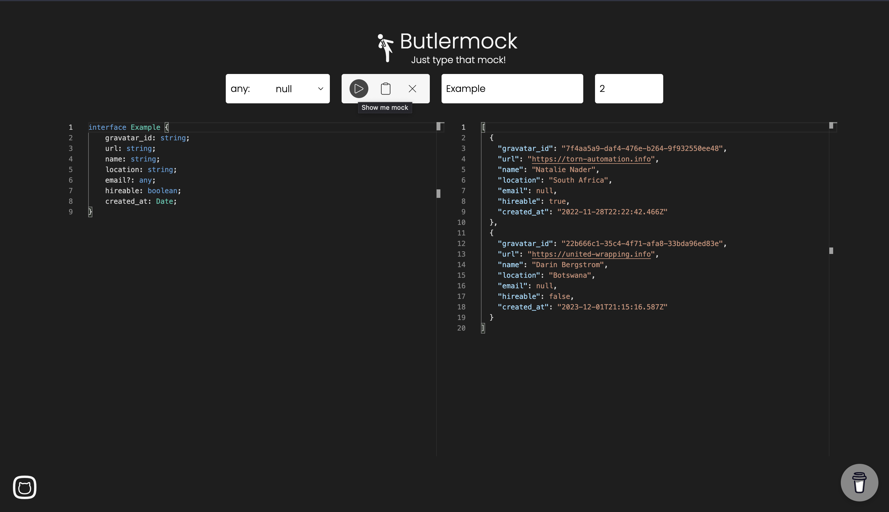
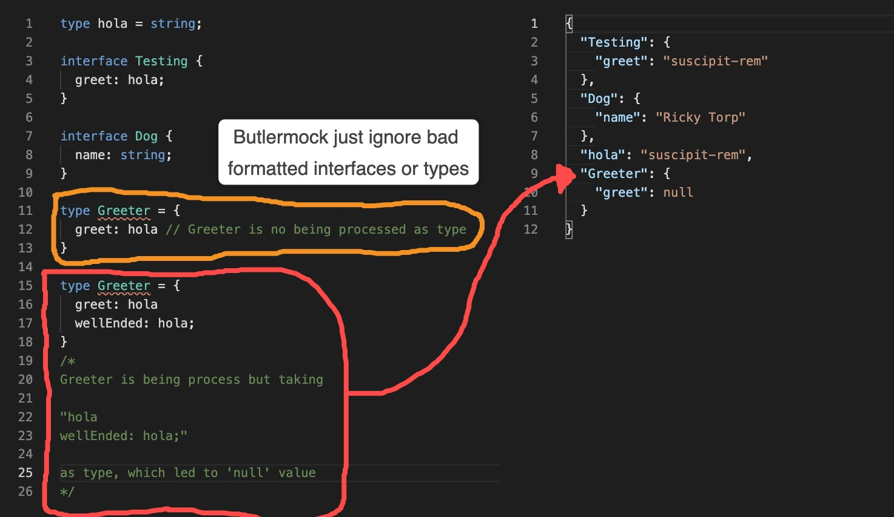

# Butlermock

[](https://fresh.deno.dev)

Tool for building mocks from typescript's types/interfaces into object
with actual data using Fakerjs

> Documentation on develop, in the near future I will expose the endpoints for you to use it within your client application, so, stay on tune 🐒

|branch|test env|desc|status|
|------|--------|----|------|
|[feature/support-for-primitives](https://github.com/Devrax/Butlermock/tree/feature/support-for-primitive-types)|https://butlermock--feature-support-for-primit.deno.dev/|Added support for primitives types| Testing |

Table of contents
=================

<!--ts-->
   * [Web usage](#web-usage)
   * [API usage](#api-documentation)
   * [Example as standalone library](#Example-as-standalone-library)
   * [FAQs](#faqs)
   * [Status](#status)
<!--te-->

# Web usage

Just go to https://butlermock.deno.dev/ and in the left panel paste your interfaces or types, just be aware of the [current limitations](#status) 🥲 ( I am working for supporting the others )

Wait until the monaco editor shows up and paste your interfaces to later clicking the play button and the mock shows up almost immediately.



> 

> The "play" button mocks up, "clipboard" copies the mock created and the "X" button is for cleaning the view

# API documentation

Easy peasy

``` typescript

fetch(new URL("/api/mock", 'https://butlermock.deno.dev').href, {
    method: "POST",
    headers: {
      "content-type": "application/json",
    },
    body: JSON.stringify({
      value: `interface Test {
        Hello: "World!";
        }`,
      valueForAny: "null", // any parseable json value, values: "null" | "\"Whatever the text you want\"" | "{}" | "0" | "1" | ... | "9"
      mustReturn: "", // empty or the top-level name of the interfaces that you provided
    }),
  })
  .then(res => res.json()).then(console.log); // should log:
  //{
  // "Test": {
  //    "Hello": "World!"
  //  }
  //}

```

> **Always remember to format your interfacer or type correctly, if you forget to add ";" it may result in bad parsing** ;


``` typescript
new interface2mock(`interface Test {
  Hello: "World!" // No closing semicolon ( ; )
  supa: string;
}`).buildMock()

/*
{
  "Test": {
    "Hello": "World!supa"
  }
}
*/
```

### Recommedations when using the API

If you are going to consume the API I suggest that you use fetch() instead of your own HTTPS calling implementation, to avoid sending credentials which I don't store, but security reasons try to use it in the way I suggest, just for privacy reasons. **REPEATING, I DO NOT STORE ANY DATA. :)**.


# Example as standalone library

```typescript
import Interface2Mock from "@core/class/TypeMocker.ts";

const mock = new Interface2Mock(`interface GithubUser {
	login: string;
	id: number;
	node_id: string;
	avatar_url: string;
	gravatar_id: string;
	url: string;
	html_url: string;
	followers_url: string;
	following_url: string;
	gists_url: string;
	starred_url: string;
	subscriptions_url: string;
	organizations_url: string;
	repos_url: string;
	events_url: string;
	received_events_url: string;
	type: string;
	site_admin: boolean;
	name: string;
	company?: any;
	blog: string;
	location: string;
	email?: any;
	hireable: boolean;
	bio: string;
	twitter_username?: any;
	public_repos: number;
	public_gists: number;
	followers: number;
	following: number;
	created_at: Date;
	updated_at: Date;
}`);

console.log(mock.buildMock());
/*
{
  GithubUser: {
    login: "deserunt-voluptatum-ipsa",
    id: 2282223950626816,
    node_id: "2dc8a6d1-1ab9-483e-9862-d441777c7ee7",
    avatar_url: "https://cloudflare-ipfs.com/ipfs/Qmd3W5DuhgHirLHGVixi6V76LhCkZUz6pnFt5AJBiyvHye/avatar/265.jpg",
    gravatar_id: "34c631dd-5702-4c62-a11e-80df124cf993",
    url: "https://adorable-decryption.com/",
    html_url: "https://daring-wifi.biz/",
    followers_url: "https://pushy-beast.name/",
    following_url: "https://bright-tusk.biz",
    gists_url: "https://ill-fated-external.net",
    starred_url: "https://yellow-fahrenheit.name",
    subscriptions_url: "https://familiar-name.info/",
    organizations_url: "https://wrong-painting.net/",
    repos_url: "https://fabulous-scraper.net/",
    events_url: "https://complicated-tradition.com",
    received_events_url: "https://front-soul.info/",
    type: "natus-repudiandae",
    site_admin: false,
    name: "Ramona Kilback",
    company: null,
    blog: "ratione-consequatur",
    location: "amet-officiis-tempora",
    email: null,
    hireable: false,
    bio: "",
    twitter_username: null,
    public_repos: 7861263249965056,
    public_gists: 2788398970437632,
    followers: 2588651141726208,
    following: 7024883036848128,
    created_at: 2022-08-31T06:03:04.388Z,
    updated_at: 2023-03-11T17:52:55.215Z
  }
}
*/

console.log(mock.buildMock("GithubUser"));
/*
{
    login: "deserunt-voluptatum-ipsa",
    id: 2282223950626816,
    node_id: "2dc8a6d1-1ab9-483e-9862-d441777c7ee7",
    avatar_url: "https://cloudflare-ipfs.com/ipfs/Qmd3W5DuhgHirLHGVixi6V76LhCkZUz6pnFt5AJBiyvHye/avatar/265.jpg",
    gravatar_id: "34c631dd-5702-4c62-a11e-80df124cf993",
    url: "https://adorable-decryption.com/",
    html_url: "https://daring-wifi.biz/",
    followers_url: "https://pushy-beast.name/",
    following_url: "https://bright-tusk.biz",
    gists_url: "https://ill-fated-external.net",
    starred_url: "https://yellow-fahrenheit.name",
    subscriptions_url: "https://familiar-name.info/",
    organizations_url: "https://wrong-painting.net/",
    repos_url: "https://fabulous-scraper.net/",
    events_url: "https://complicated-tradition.com",
    received_events_url: "https://front-soul.info/",
    type: "natus-repudiandae",
    site_admin: false,
    name: "Ramona Kilback",
    company: null,
    blog: "ratione-consequatur",
    location: "amet-officiis-tempora",
    email: null,
    hireable: false,
    bio: "",
    twitter_username: null,
    public_repos: 7861263249965056,
    public_gists: 2788398970437632,
    followers: 2588651141726208,
    following: 7024883036848128,
    created_at: 2022-08-31T06:03:04.388Z,
    updated_at: 2023-03-11T17:52:55.215Z
}
*/
```

You also can have multiple interface and/or type

```typescript
const test = new Interface2Mock(`interface simpleObject {
    iAmSimple: boolean;
  }

  type notSimpleObject = {
    iCanBeSimple: dontCare;
  }

  type dontCare = {
    doICare: boolean;
  }`);

console.log(test.buildMock());
/*
{
  simpleObject: { iAmSimple: true },
  notSimpleObject: { iCanBeSimple: { doICare: false } },
  dontCare: { doICare: true }
}
*/

console.log(test.buildMock("simpleObject")); // { iAmSimple: true }
```

# Guide when providing an interface or type to be mocked up

```typescript
const mock = new Interface2Mock(`interface Greeting {
    hello: string;
    cursed: {
        damn: string;
    }[];
  }`); // ❌ Butler mock cannot process direct objects, yet
```

```typescript
const mock = new Interface2Mock(`interface Greeting {
    hello: string;
    cursed: CursedWord[];
  }

  type CursedWord = { damn: string; }`); // ✅ Butler Mock can format this way
```

# FAQs

### **Q: Is it using an AI?**
A: No :)

### Q: How can I tell the API or website to give me a fixed value?
A: You just type explicitly the value you want:
``` typescript
interface ThisIsSparta {
  troops: 300;
  leader: "Leonidas";
  murderedBy: true;
}

interface mightBeSparta {
  troops: 200 | 594 | 2893 | 39;
  leader: "Trump" | "Me" | "You?";
  murderedBy: true; // fixed Booleans can not be multiples values, for that use explicitly 'boolean'
}
```

### Q: Can I copy full code snippet and it will detect the interfaces?
A: Yes :)


# Status

- [x] *Interfaces*
```typescript
interface NonMockeableInterface {} // ❌ empty interface

interface MockeableInterface {
  somethingToMock: any;
} // ✅ Mockeable

export interface AnotherMockeableInterface {
  anotherThingToMock: any;
} // ✅ Mockeable, 'export' is ignored
```

<br />

- [x] Interfaces with nested interfaces/types
```typescript
type mockeableType = {
  name: string;
} // ✅ Mockeable

interface MockeableInterface {
  somethingToMock: any;
  nestedInterface: AnotherMockeableInterface;
  extraNestedInterface: AnotherMockeableInterface[];
} // ✅ Mockeable

export interface AnotherMockeableInterface {
  anotherThingToMock: any;
} // ✅ Mockeable, 'export' is ignored
```

<br />


- [ ] Interfaces that extends from other interfaces/types
``` typescript
// Not mockeable yet
interface That { ... }

interface This extends That {} // ❌
```

<br />

- [ ] Generic Interfaces
``` typescript
// Not mockeable yet
interface This<T> {
  here: T;
} // ❌
```

<br />

- [ ] Generic Interfaces that extends from other interfaces/types
```Typescript
// Not mockeable yet
interface Evnt<T> {
  name: T;
}

interface IPropertiesToAdd<T> extends Evnt<T> {
  on(): void;
  off(): void;
} // ❌
```

<br />

- [x] Primitive Type
``` typescript
// Not mockeable yet
type justString = string; // ✅ Mockeable
```

<br />

- [x] Type object
``` typescript
type justString = {
  yes: 'you can';
}; // ✅ Mockeable
```

<br />

- [x] Type with nested interfaces/types
``` typescript

type mockeableType = {
  nestedObject: MockeableInterface;
} // ✅ Mockeable

interface MockeableInterface {
  somethingToMock: any;
} // ✅ Mockeable
```

<br />

- [ ] Generic Type
``` typescript
// Not mockeable yet
type IPropertiesToAdd<T extends {}> = T & {
    on(): void
    off(): void
}; // ❌
```